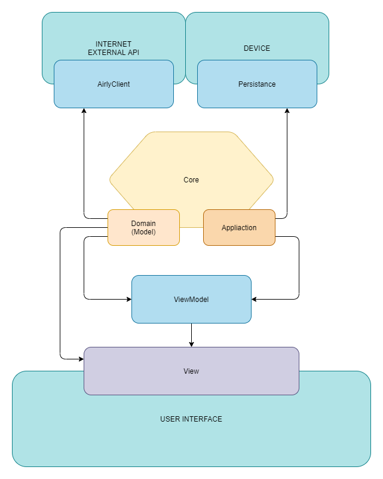

# __WSEI/Mobile/Xamarin__ `AirMonitor`

## Synopsis

`AirMonitor` is a semester project on university for subject "Programming mobile application". Project was provided partially done, with instructions how to accomplish next steps.

Fallowing instructions can be found under project - [directory](./AirMonitorDocs/Instructions/).

Project base source - [wsei-xamarin](https://github.com/matteozajac/wsei-xamarin/).

## Scope

Project was created for `Android` only.

## Topic

It is a small android application allowing its user to __check current air condition__ in nearby area.

Application integrates with [Airly](https://airly.eu/) to request such data. It also stores it in local database and allows usage of recently requested data until its no longer valid (time passed).

## Stack

- Android
- c#
  - System.Net (http client)
  - Xamarin.Essentials (Loaction)
  - Xamarin.Forms
  - Xamarin.Forms.Maps (google-play-services)
  - Newtonsoft object mapping (JSON)
  - Autofac (di)
  - sqlite-net-pcl (database connection and orm)
- sqlite

## Architecture

Application was created in a specific combination of `MVVM` and `hex` architectures, where layers are provided by `DI Container`.

The fallowing was a result of `attempt to separate different application layers` with as few dependencies as possible. The initial plan was not fully achieved since different layers were not excluded to separate projects or portable modules. Nevertheless `dependency between namespaces is minimal`.

1. __`Core`__
   - `Domain` - Definitions of application objects and mappings, also __Model__ for __MVVM__ architecture, which probably should be separated further.
   - `Application` application internal api provided as interfaces. Thanks to this approach for example `ViewModel` does not have to be aware of existence of `Service`, only its external api `IService`.

1. __`Persistance`__
    - Implementation of database entity mapping objects for orm engine.
    - Implementation of database connection engine.
    - Implementation of repositories used to access/save data.

1. __`Client`__
    - Implementation of generic http connection and response handling.
    - Implementation of external Airly client.

1. __`ViewModel`__
   - Gateway between application back logic, and user interaction.

1. __`View`__
   - Rendering user view.
   - Noticing user actions, and requesting proper logic from ViewModel.

`Disclaimer` Model have been moved to Core/Domain it would be advisable to add additional dto layer and move domain out of core as Model.

